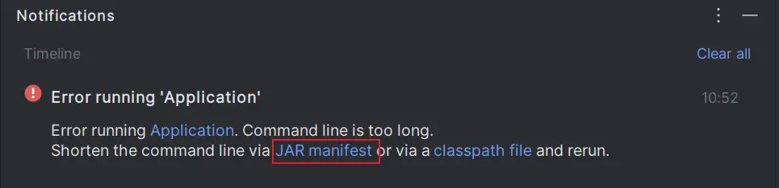

## 最简单的方法
在错误信息中直接点击 JAR，IDEA 就会自动帮你添加配置，再次启动即可。


## 纯 GUI 的方法

最近又发现了一个新的办法，不需要记命令。具体方法如下

1. On the edit configuration menu, click on modify options
2. And then select Shorten command line
3. Select JAR manifest option, apply & run


原帖地址： https://stackoverflow.com/a/69349044/13621750

## 直接修改配置文件的方法

在项目的 .idea/workspace.xml 文件中，找到

```xml
<component name="PropertiesComponent">
```

下面添加一行

```xml
<property name="dynamic.classpath" value="true" />
```