集成之后可以在控制中心中直接控制灯类与开关类电器，无需再打开米家 App。  
可以先浏览最底部的参考资料的视频，大致了解一下整个集成的难度再来决定是否入这个坑。

## 开启 Docker 服务 与下载镜像

首先开启极空间中的 `Docker` 服务。 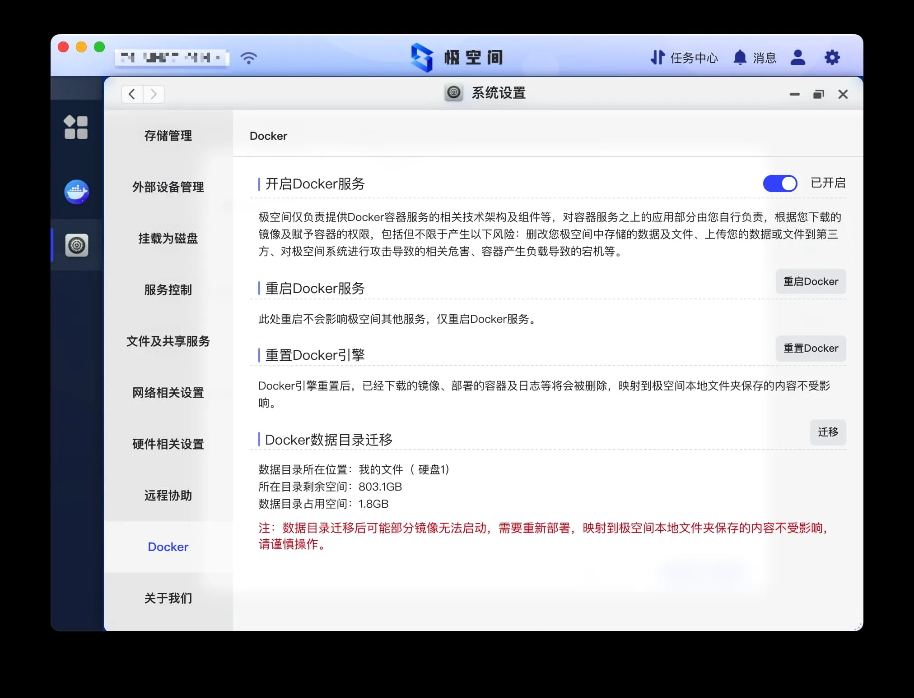

下载 `Home Assistant` 镜像，选择下载第一个。  


下载完后在本地镜像中双击打开刚下载的镜像。  


## 安装 HA

### 启动容器

基本设置保持默认即可。 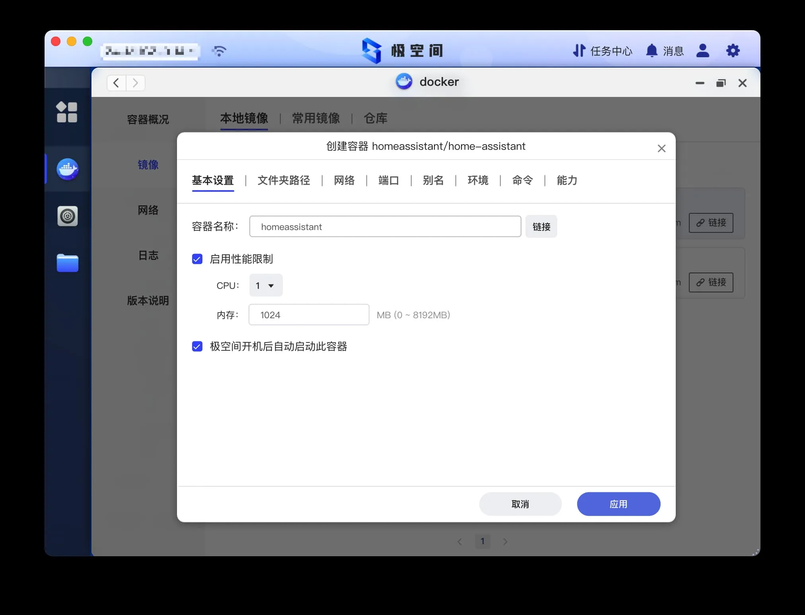

目录建议按照 `Docker/{应用名称}/{映射目录}` 的规则进行设置  


网络需要设置为 `host` 否则之后无法添加到 HomeKit  
选中 bridge -> 点击 更换 -> 选中 host -> 确定  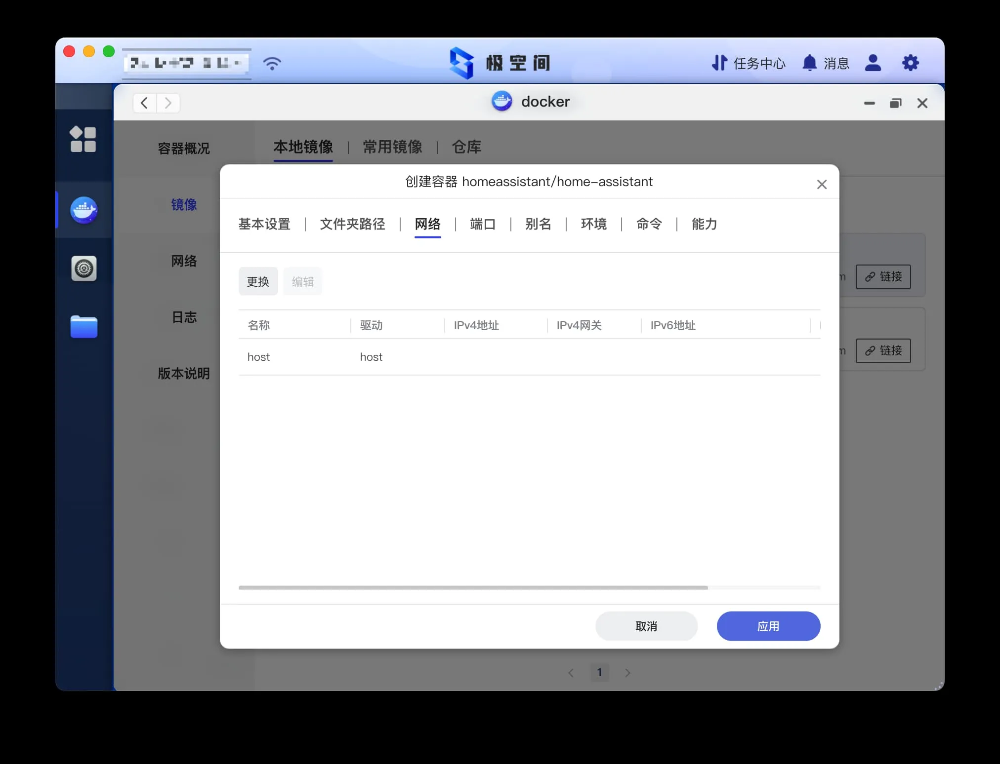

端口由于使用了 host，就不设置了。 

点击 应用 ，启动容器。

### 修改配置

由于默认端口被极空间占用，因此需要修改配置文件来制定其他的端口。  
等待日志中出现错误后停止容器，下载配置文件进行修改。  


配置文件路径如下。  


下载到本地，修改成如下内容。然后再上传到之前的文件夹中，覆盖原文件。

```yml
# Configure a default setup of Home Assistant (frontend, api, etc)
default_config:

# Text to speech
tts:
  - platform: google_translate

#group: !include groups.yaml
automation: !include automations.yaml
script: !include scripts.yaml
scene: !include scenes.yaml
http:
  # 下面这个是端口号，修改成自己喜欢的就行。
  server_port: 8848
```

点击容器概况->home assistant 容器的 更多->重启，对容器进行重启。  


重启容器之后，如果无法用 `http://{nas的IP}:{你设置的端口}` 打开的话。建议复制日志，检查是否出现端口冲突错误。错误关键字如下，其中 8123 就是冲突的端口号

```
[Errno 98] error while attempting to bind on address ('0.0.0.0', 8123): address in use
```


一切顺利的话，你将看到这个欢迎界面。根据提示输入用户名和密码创建账户，一定要记住，这个没的重置只有重装的。 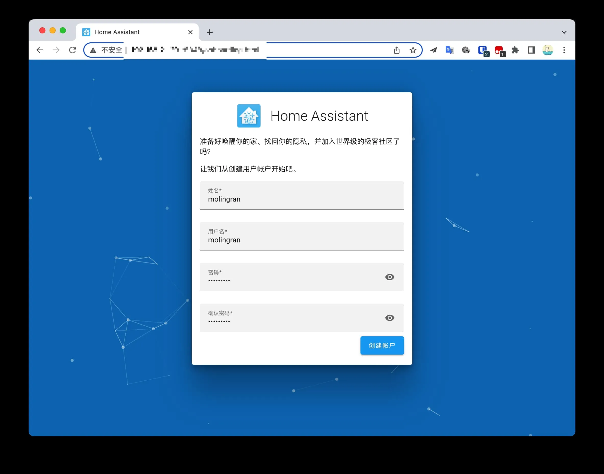

剩下的都直接下一步即可。  
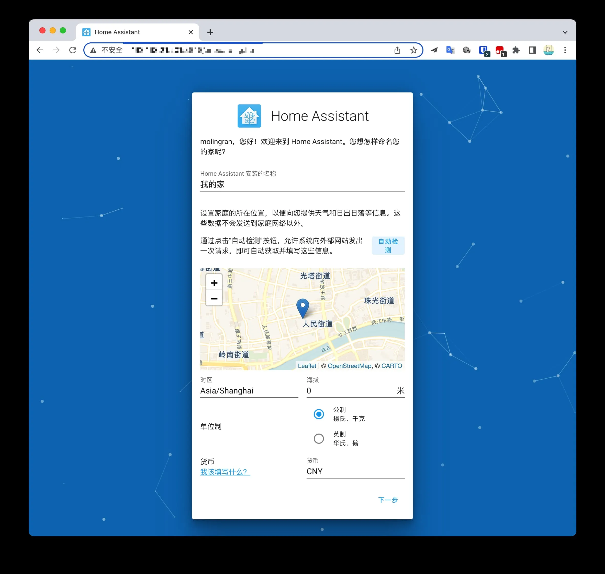 

成功进入首页，Home Assistant 安装成功。  


## 集成米家与 HomeKit

### 安装 HACS

HACS 为您提供了一个强大的 UI 来处理您所有自定义需求的下载。

#### 一键安装

如果 Nas 访问 GitHub 通畅的话，直接使用官网提供的 HACS 安装脚本，使用 SSH 安装即可。

但是如果访问尚有困难，请直接参考 [手动安装](./#手动安装)

以下是自动安装的内容。首先打开 SSH（终端） 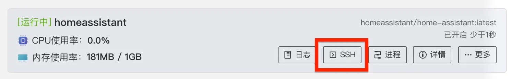

在终端中 Ctrl+V 粘贴下面这个指令。按回车，执行指令。

```bash
wget -O - https://get.hacs.xyz | bash -
```


看到控制台里输出说明安装成功了，接着就可以 [应用 HACS](./#应用-hacs)。

```
Remember to restart Home Assistant before you configure it
```

#### 手动安装

如果你的网络环境不支持访问 GitHub 的话，还可以手动安装。

先下载 hacs 的安装包，有两种下载方式。

1. GitHub 官网下载，保证使用的是最新版的。 https://github.com/hacs/integration/releases
2. 蓝奏云备份的，22 年 8 月 22 日更新的 1.27.1 版本。 https://moreant.lanzoul.com/i3wA90ayutva

下载完成后，在 Docker 的文件中新增 `custom_components` 文件夹。将下载的 hacs 安装包重命名为 `hacs` **注意后缀名是否正确**，上传至 custom_components 文件夹，解压。 

#### 应用 HACS

在 配置->系统 页面中点击右上角的 重新启动 按钮。 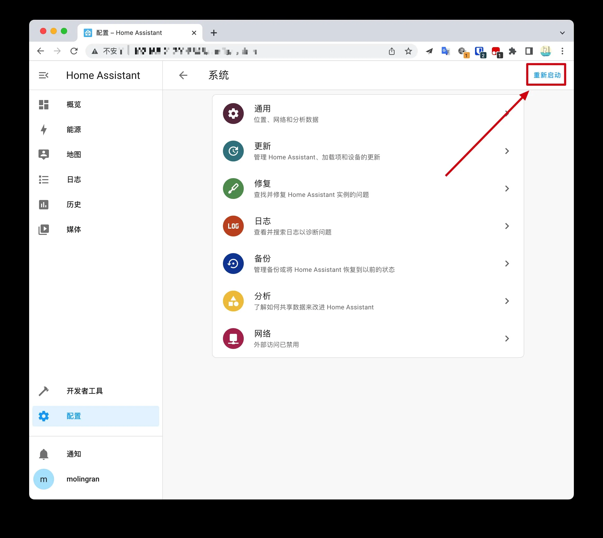

左下角提示重启成功后，进入集成界面。 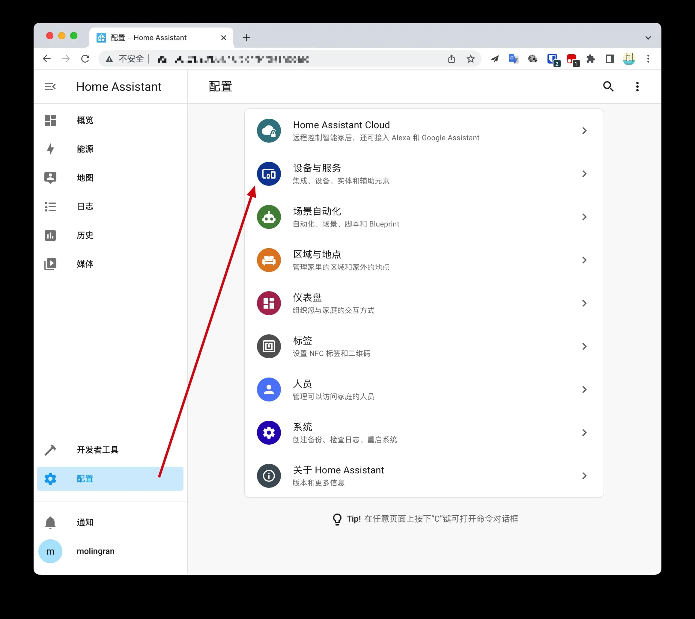

搜索并点击 HACS。 

全部勾选，点击提交。 

复制下方代码，点击链接激活设备。 

粘贴代码，提交后点击授权即可。 

回到 HA，点击完成 

### 集成米家

点击左侧菜单的 HACS->集成->浏览并下载存储库，选择 Xiaomi Miot Auto，点击右下角的下载->下载。 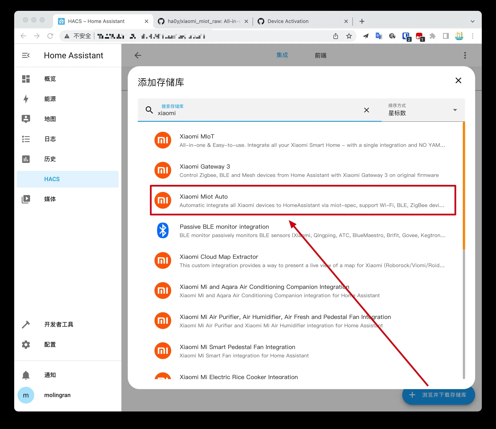

安装完成后点击左侧菜单的 HACS，点击等待重启中的前往 

点击 重新启动->重新启动，重启完成后左下角会显示重启完成。 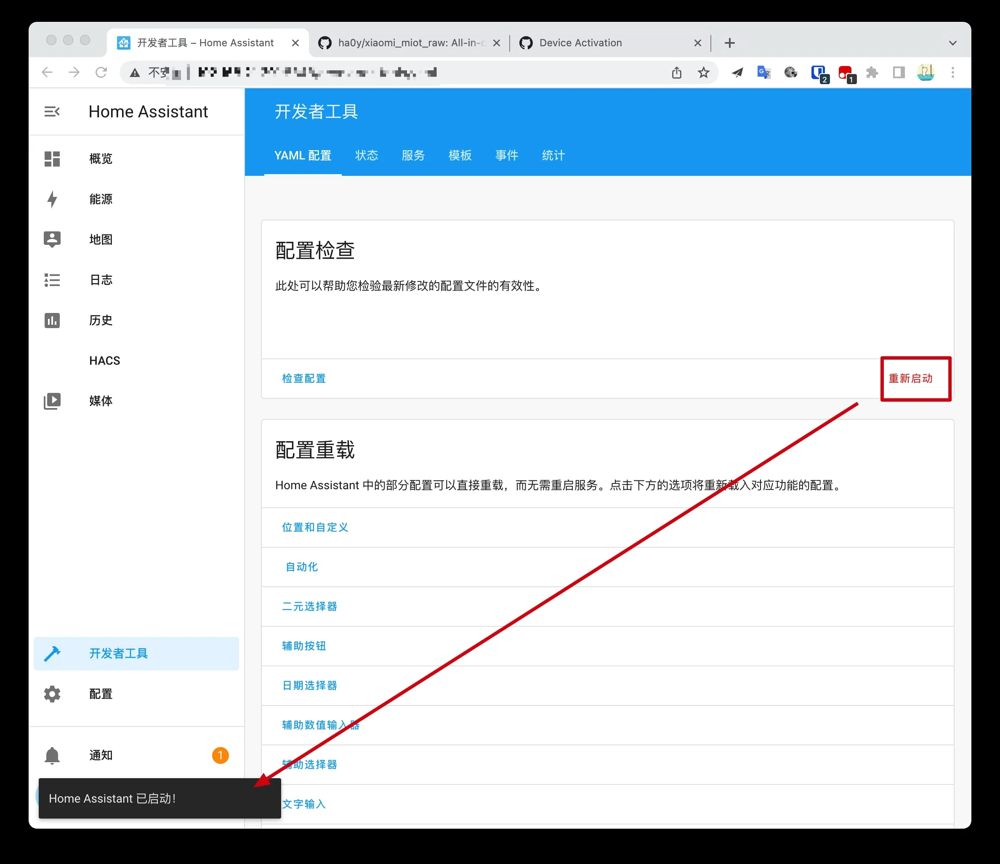

回到之前添加 HACS 的界面，这次添加 Xiaomi Miot Auto 集成了。选择账号集成。 

输入小米账号，会自动添加米家中已有的设备 

根据需要排除或包含需要控制的设备 

如果需要在 HA 控制就设置一下设备房间。HomeKit 是需要另外设置的。 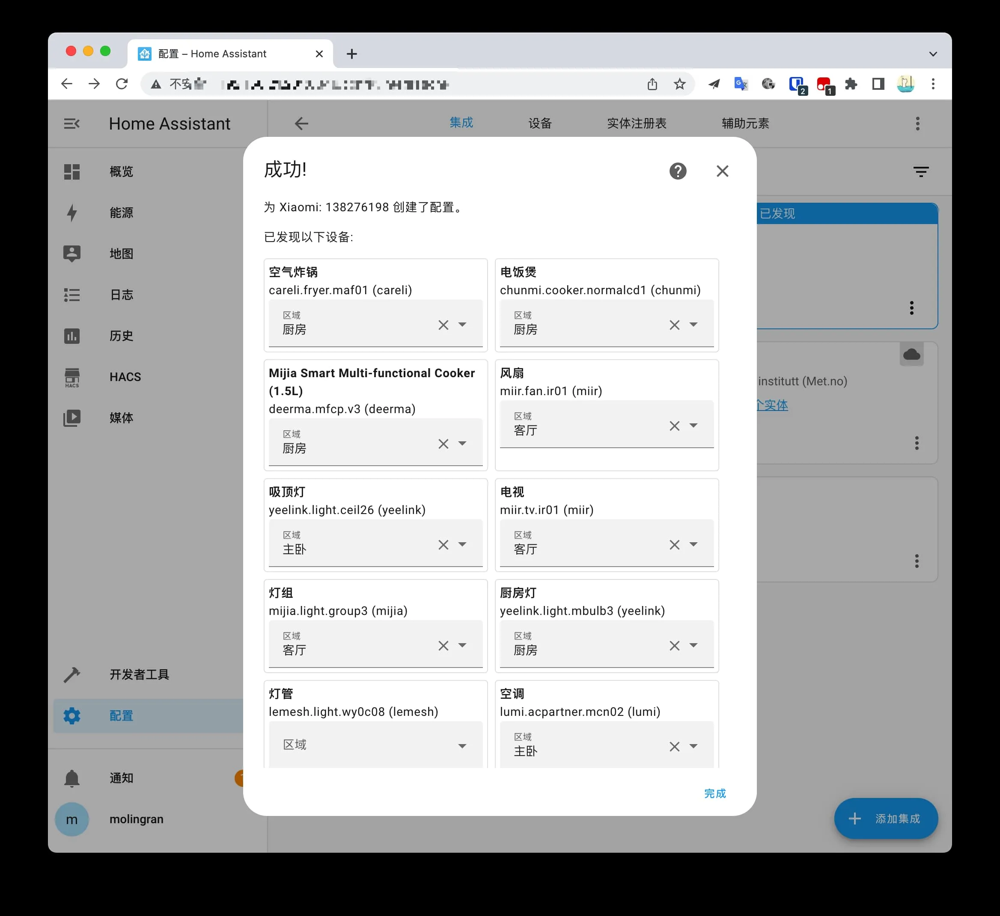

恭喜，米家已经集成完毕


### 集成 HomeKit

#### 添加设备

HomeKit 集成就简单了，回到添加 HACS 与 Miot Auto 的界面。点击 HomeKit 的配置。 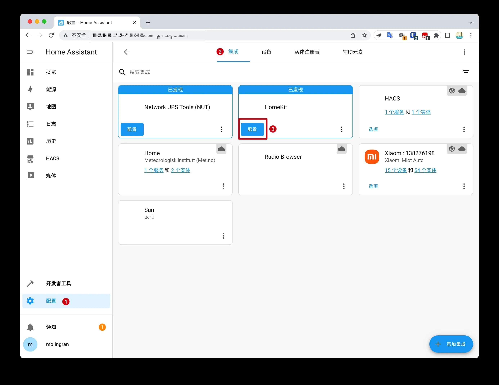

直接提交。继续提交。区域随便选一个。完成。 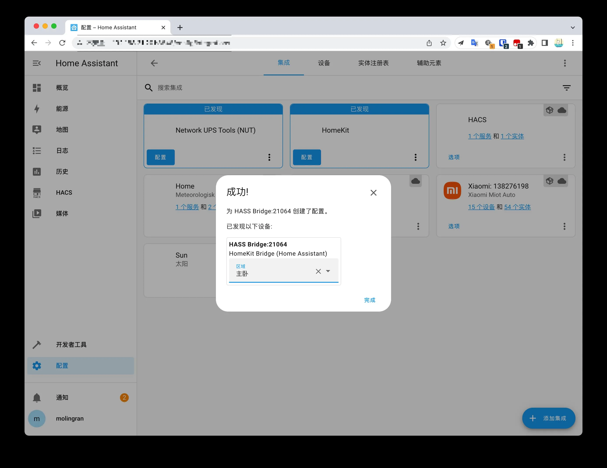

点击左下的通知，使用手机里的家庭中的“添加或扫描配件”，扫描这个二维码即可添加米家的设备了。 

#### 设置设备

扫描二维码。  
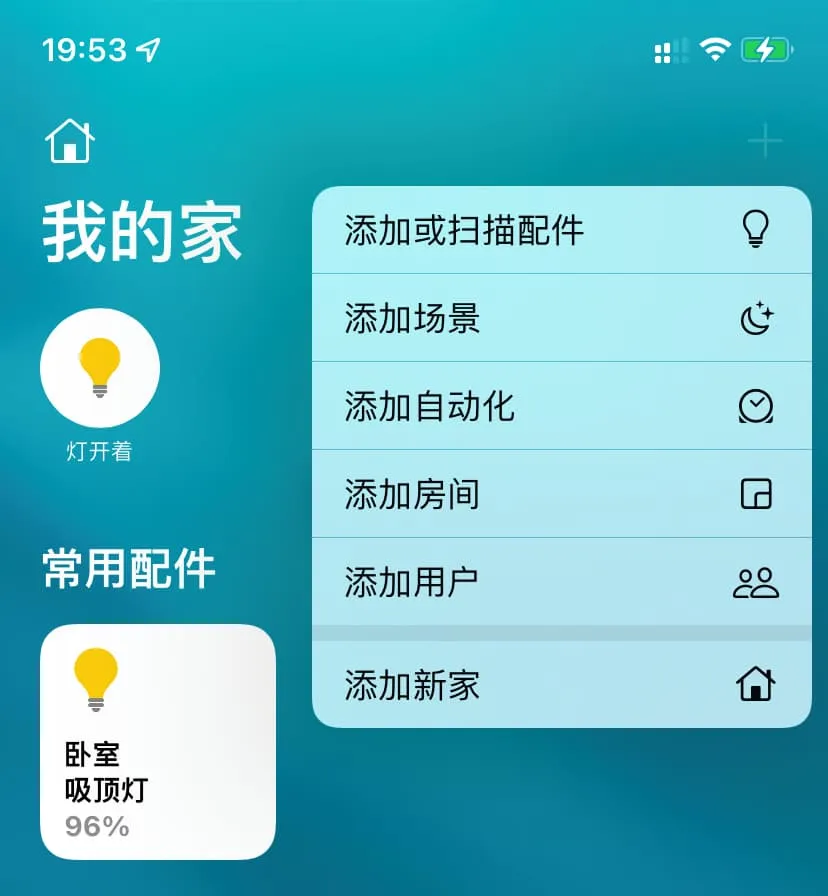

仍然添加。  


如果不小心添加到不需要的配件，可以新建一个房间集中放置这些配件。并且移出在“常用配件”中。 

## 参考资料

> > [Home Assistant 篇二：群晖 Docker 安装 Home Assistant*NAS 存储*什么值得买](https://post.smzdm.com/p/az370qk5/)  
> > [7 分钟学会搭建 homeassistant，米家设备免费接入 HomeKit-哔哩哔哩](https://b23.tv/eRkzaE3)
