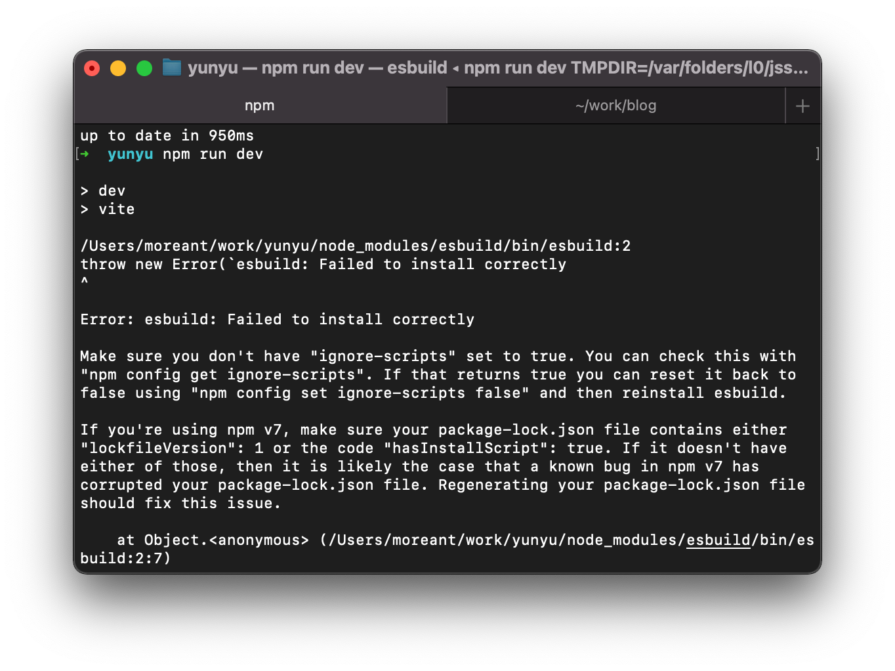

## 问题描述
用 Vite2 的 Vue 模板新建了一个项目，执行 `npm run dev` 时出现以下报错
```
Error: esbuild: Failed to install correctly
```





## 解决方法
一顿百度之后找到了这个 issues [Broken install binary on macOS](https://github.com/evanw/esbuild/issues/462#issuecomment-771328459) 
在执行 `npm run dev` 先执行以下命令即可

```
node node_modules/esbuild/install.js
```

> 感谢这篇博文的指路
> [vite安装vue项目报错（Error: esbuild: Failed to install correctly）](https://blog.csdn.net/m0_37682004/article/details/115001613)
