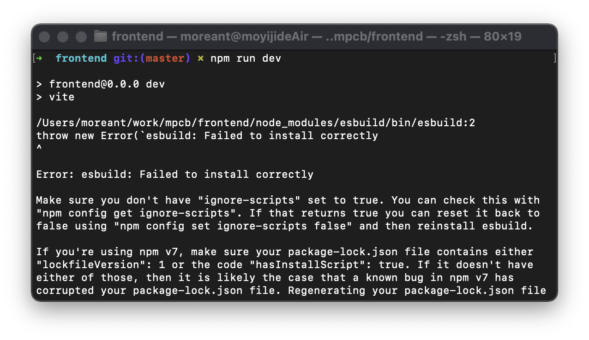

## 问题描述
```
➜  frontend git:(master) ✗ npm run dev

> frontend@0.0.0 dev
> vite

/Users/moreant/work/mpcb/frontend/node_modules/esbuild/bin/esbuild:2
throw new Error(`esbuild: Failed to install correctly
^

Error: esbuild: Failed to install correctly

Make sure you don't have "ignore-scripts" set to true. You can check this with
"npm config get ignore-scripts". If that returns true you can reset it back to
false using "npm config set ignore-scripts false" and then reinstall esbuild.

If you're using npm v7, make sure your package-lock.json file contains either
"lockfileVersion": 1 or the code "hasInstallScript": true. If it doesn't have
either of those, then it is likely the case that a known bug in npm v7 has
corrupted your package-lock.json file. Regenerating your package-lock.json file
should fix this issue.
```


  
## 解决方法
执行以下指令来手动安装 `esbuild`
```
node node_modules/esbuild/install.js
```

然后就可以正常启动 Vite 项目了

## 参考资料
> [1. vite安装vue项目报错（Error: esbuild: Failed to install correctly）](https://blog.csdn.net/m0_37682004/article/details/115001613)  
> [2. Broken install binary on macOS](https://github.com/evanw/esbuild/issues/462#issuecomment-782833191)